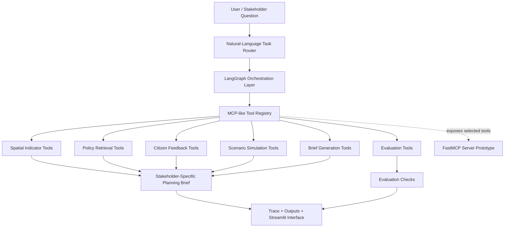

# Everyday Access Planning Agent

A stakeholder-facing agentic urban intelligence prototype for MRT station-area everyday access and public realm planning.

## Project Overview

The Everyday Access Planning Agent demonstrates how an agentic workflow can synthesize structured station-area indicators, synthetic policy-style text, and synthetic citizen feedback into stakeholder-specific planning briefs. The project is intentionally small and auditable: deterministic tools perform the analysis, a LangGraph workflow orchestrates the process, and trace/evaluation outputs make each step inspectable.

This is a research demo, not an operational planning system. It uses Singapore-style MRT station area names for readability, but all indicators, policy documents, and citizen feedback are synthetic.

## Current Status

- Deterministic urban analysis tools implemented.
- LangGraph workflow implemented.
- MCP-like tool registry implemented.
- Minimal FastMCP server implemented.
- Streamlit mobile-style interface implemented.
- Test suite passing: 23 tests.

## Motivation

Residents, policy makers, and researchers often need different explanations from the same evidence base. A resident may ask why their area feels uncomfortable or inaccessible. A policy maker may need a concise prioritization brief under resource constraints. A researcher may want to inspect assumptions, weights, and limitations.

This prototype explores evidence orchestration for those different audiences. It is not intended to replace planners, local knowledge, fieldwork, professional judgment, or statutory planning processes. Instead, it shows how agentic software patterns can organize evidence, surface uncertainty, and produce traceable planning communication.

## What This Demo Shows / What This Demo Does Not Claim

This demo shows a traceable workflow for routing stakeholder questions, coordinating deterministic planning tools, assembling synthetic evidence, and producing audience-specific planning briefs.

It does not claim to measure real MRT station-area conditions, represent official policy, predict planning outcomes, or make real policy recommendations.

## Urban Planning Framing

An **everyday access area** is defined here as a walkable area around an MRT station or neighborhood transit node where people reach daily services, public spaces, and community infrastructure.

The demo scoring workflow uses four synthetic planning concepts:

- **Everyday access deficit**: a composite measure of weaker access to everyday destinations such as transit, hawker food, groceries, clinics, parks, and community centers.
- **Public realm deficit**: a composite measure of weaker street and public-space conditions such as sidewalk quality, crossing safety, shade, seating, greenery, and barrier-free access.
- **Community need**: a normalized score based on synthetic demographic and density indicators, including elderly share, children share, low-income share, rental housing share, and population density.
- **Citizen concern score**: a synthetic feedback-derived concern score calculated from illustrative resident comments and sentiment labels.

These concepts are implemented for demonstration only and should not be interpreted as real measurements of Singapore station areas.

## System Architecture



The project also includes a separate real MCP server prototype. That server is not required by the LangGraph workflow or Streamlit app; it is an additional integration layer for MCP-compatible clients to discover and call selected urban intelligence tools.

## Components

- **Deterministic urban tools**: load synthetic data, calculate planning scores, retrieve synthetic policy snippets, summarize synthetic feedback, simulate interventions, generate briefs, and evaluate outputs.
- **LangGraph workflow**: orchestrates routing, spatial analysis, policy retrieval, feedback summary, scenario simulation, brief generation, evaluation, and output writing.
- **Task router**: uses deterministic keyword rules to infer stakeholder type, analysis focus, target station area, scenario type, and brief style from a user question.
- **MCP-like tool registry**: provides internal metadata and dispatch for deterministic tools, similar in spirit to tool discovery.
- **Real MCP server**: exposes selected read-only or low-risk tools through a minimal FastMCP stdio server.
- **Streamlit mobile-style interface**: provides a stakeholder-facing civic planning assistant mockup for asking questions and viewing evidence, briefs, traces, and tools.
- **Evaluation and trace outputs**: record workflow steps and run deterministic checks for grounding, stakeholder relevance, limitations, and absence of unsupported real-data claims.

## MCP Server Prototype

The MCP server prototype is implemented with FastMCP from the official Python `mcp` package. It is real but intentionally minimal.

It exposes four tools:

- `list_station_area_priorities`
- `get_station_area_explanation`
- `search_policy_context`
- `simulate_station_area_intervention`

The server uses only synthetic local demo data. It does not expose arbitrary filesystem access, shell command execution, external credentials, external API keys, or live data connections.

## How to Run

Create and activate a virtual environment, then install dependencies:

```bash
python -m venv .venv
source .venv/bin/activate  # Windows: .venv\Scripts\activate
pip install -r requirements.txt
```

Run tests:

```bash
python -m pytest
```

Run the LangGraph demo:

```bash
python src/run_langgraph_demo.py
```

Run the Streamlit interface:

```bash
streamlit run src/streamlit_app.py
```

Run the MCP server prototype:

```bash
python -m src.mcp_server.server
```

Outputs are written to `outputs/`; traces are written to `traces/`.

## Example Questions

- Can you explain why Toa Payoh feels hot for residents?
- How should policy makers prioritize budget investment for crossing safety?
- Compare the method assumptions and weights in the model.

## Data Disclaimer

**All station-area indicators, policy texts, and citizen feedback are synthetic demo data and not real Singapore measurements.**

The generated outputs are illustrative workflow demonstration results. They are not empirical findings, official policy analysis, or planning advice.

## Current Limitations

- Synthetic data only.
- Deterministic keyword router.
- No real RAG over actual policy documents yet.
- No real geospatial geometries or maps yet.
- No live API or data connection.
- Outputs are illustrative and should not be used as planning advice.

## Possible Next Steps

- Connect real spatial datasets.
- Add RAG over actual planning documents.
- Connect real citizen feedback sources.
- Add map-based station catchment visualization.
- Benchmark against manual planning workflows.
- Add human-in-the-loop validation.
- Expand MCP tools and connect to an MCP-compatible client.

## Relevance to Agentic Urban Intelligence

This prototype is a compact demonstration of agentic urban intelligence patterns: a user question is routed into a structured task, LangGraph orchestrates deterministic planning tools, an MCP-like registry standardizes tool metadata and invocation, and a real MCP server exposes selected tools for external clients. The system combines structured indicators with unstructured synthetic policy and feedback text, preserves traceability through explicit workflow steps, and produces stakeholder-facing planning briefs while keeping limitations visible.
